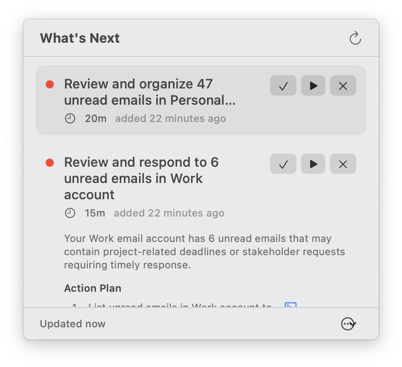
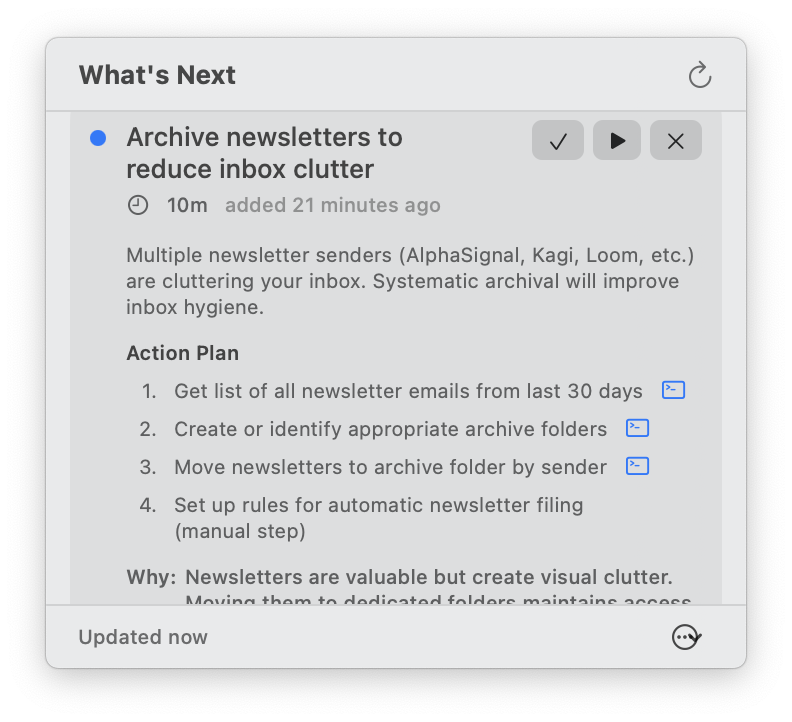
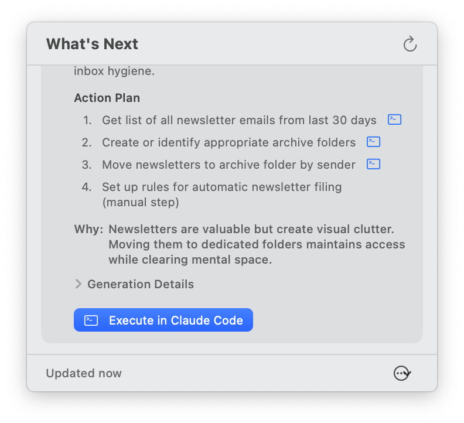

# What's Next

A macOS menu bar app that uses [Claude Code](https://docs.anthropic.com/en/docs/claude-code) to analyze your projects, emails, reminders, and bookmarks — then suggests prioritized, actionable tasks you can execute with one click.



## Features

- **AI-Powered Task Suggestions** — Claude analyzes your sources and generates specific, actionable tasks with priority levels, time estimates, and step-by-step action plans
- **Multi-Source Intelligence** — Pulls context from local project folders (git status, TODOs, recent changes), Apple Mail, Apple Reminders, and bookmarked websites
- **One-Click Execution** — Execute any suggested task directly in Claude Code from the menu bar
- **Smart Task Merging** — Tasks persist across refreshes; dismissed tasks stay dismissed, in-progress tasks are preserved
- **Configurable Exploration** — Choose which strategies to run per folder: git status analysis, TODO/FIXME scanning, recent file change detection, project structure analysis
- **Customizable Prompts** — Tune the system prompt and Claude model to match your workflow

## Screenshots

<table>
<tr>
<td width="33%">

<p align="center"><em>Prioritized task list with time estimates</em></p>
</td>
<td width="33%">

<p align="center"><em>Expanded task with action plan and reasoning</em></p>
</td>
<td width="33%">

<p align="center"><em>One-click execution in Claude Code</em></p>
</td>
</tr>
</table>

## Requirements

- macOS 14.0 (Sonoma) or later
- [Claude Code CLI](https://docs.anthropic.com/en/docs/claude-code) installed and authenticated
- Xcode 15+ (to build from source)

## Installation

### Build from Source

```bash
git clone https://github.com/patrickfreyer/WhatsNext.git
cd WhatsNext
xcodebuild -scheme WhatsNext -configuration Release build
```

The built app will be in `build/Build/Products/Release/WhatsNext.app`. Move it to your Applications folder or run it directly.

### Run in Xcode

Open `WhatsNext.xcodeproj` in Xcode and press **Cmd+R**.

## Configuration

WhatsNext stores its configuration in `~/Library/Application Support/WhatsNext/config.json`. You can configure everything through the Settings window (click the **...** menu in the popover).

### Sources

| Source | What it Analyzes |
|--------|-----------------|
| **Folders** | Git status, TODO/FIXME comments, recent file changes, project structure |
| **Mail** | Unread emails from configured mailboxes |
| **Reminders** | Pending reminders from Apple Reminders |
| **Websites** | Bookmarked URLs for context |

### Exploration Strategies

For each folder source, you can enable/disable:

- **Git Status** — Finds uncommitted changes, untracked files, and stale branches
- **TODO Scanner** — Scans source files for TODO, FIXME, HACK, and similar markers
- **Recent Changes** — Identifies recently modified files that may need attention
- **Project Structure** — Analyzes overall project organization

### Claude Settings

- **Model** — Choose between Sonnet (default), Opus, or Haiku
- **System Prompt** — Customize the instructions Claude uses to prioritize tasks
- **Max Tokens** — Control response length

## Architecture

```
WhatsNext/
├── App/                        # App entry point (MenuBarExtra)
├── Models/                     # Data models (Task, Configuration, SourceItem)
├── Protocols/                  # SourceProvider & ExplorationStrategy protocols
├── Sources/
│   ├── SourceManager.swift     # Orchestrates all source providers
│   └── Providers/              # Folder, Mail, Reminders, Website providers
├── Exploration/
│   ├── ExplorationEngine.swift # Runs exploration strategies concurrently
│   └── Strategies/             # Git, TODO, RecentChanges, ProjectStructure
├── Services/
│   ├── Claude/                 # ClaudeService, PromptBuilder, ResponseParser
│   ├── Execution/              # Terminal & Claude session launchers
│   └── Persistence/            # ConfigurationStore & TaskStore (JSON-based)
├── ViewModels/                 # MenuBarViewModel, SettingsViewModel
└── Views/
    ├── MenuBar/                # MenuBarView, TaskListView, TaskRowView
    └── Settings/               # Tabbed settings (General, Sources, Exploration, Prompt)
```

The app follows a clean separation of concerns:

1. **Source Providers** fetch raw data from configured sources
2. **Exploration Strategies** analyze folder contents using pluggable strategies
3. **Claude Service** sends the aggregated context to Claude CLI and parses the structured JSON response
4. **Task Store** persists and merges tasks across refreshes, preserving user actions (dismiss, complete)
5. **Menu Bar UI** displays prioritized tasks with expand/collapse, action buttons, and one-click execution

## How It Works

1. On launch (and at configurable intervals), WhatsNext fetches data from all enabled sources
2. Folder sources are further analyzed by exploration strategies (git status, TODO scanning, etc.)
3. All collected data is sent to Claude via the CLI with a structured prompt requesting JSON output
4. Claude returns prioritized tasks with titles, descriptions, action plans, and suggested commands
5. Tasks are merged with existing ones — new tasks appear, dismissed tasks stay hidden, in-progress tasks are preserved
6. Click any task to expand it, see the full action plan, or execute it directly in Claude Code

## License

[MIT](LICENSE)
